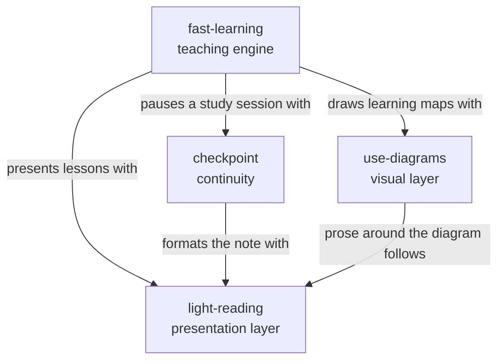

# AI Skills

My collection of AI skills.

## Skills

| Skill | Decides | Role |
| --- | --- | --- |
| [light-reading](light-reading) | **How** text reads | Presentation layer. Rewrites and formats to spend less working memory (ADHD-aware). |
| [use-diagrams](use-diagrams) | **Text or diagram**, and how to draw it | Visual layer. Draws inline in the chat when a picture explains better than prose. |
| [fast-learning](fast-learning) | **What** to teach, when to test, when to move on | Teaching engine. Micro-lessons with retrieval, practice, and mastery checks. |
| [checkpoint](checkpoint) | **What** goes into a pause note | Continuity. Lets you stop now and resume later without reconstructing. |

## How they connect

Each skill owns one decision and loads the others when they are available. None of them requires the others to work.

Where two skills disagree, the more specific one wins for its own output:

- **Next action placement.** light-reading puts it first. In a fast-learning teaching turn, the question goes last. In a checkpoint note, the next action goes first.
- **Persistence.** light-reading's session-wide mode turns on only when you ask for it. When another skill loads it, it applies to that output only.
- **Diagrams in lessons.** A diagram supports the explanation and never contains the answer to the question that ends the turn.
- **Diagrams in notes.** Checkpoint notes stay plain text so they can be pasted into a new chat.
- **Pausing a study session.** fast-learning hands its session state to checkpoint, which lists review items by name only, so resuming starts with retrieval instead of rereading.

## Install

Run `.\install.ps1` in PowerShell after any change. It replaces older copies and:

- copies every skill to `~/.claude/skills` (Claude Code) and `~/.agents/skills` (ChatGPT desktop / Codex). GitHub Copilot in VS Code reads both folders;
- builds `dist/<skill>.zip` for Claude Desktop / claude.ai. Upload them in Settings > Capabilities > Skills, after deleting the old versions.
